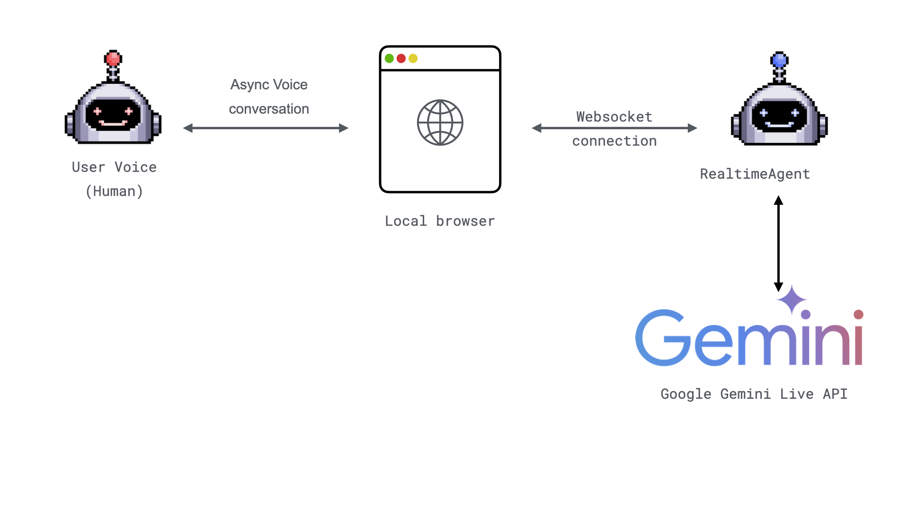

  
Authors:

  <CardGroup cols={2}>
    <Card href="https://www.linkedin.com/in/xingyu-xiang/">
        

          

            
          

          

            
Stella Xiang

            
Developer

          

        

    </Card>
    <Card href="https://github.com/marklysze">
        

          

            
          

          

            
Mark Sze

            
Software Engineer at AG2.ai

          

        

    </Card>
    <Card href="https://github.com/sternakt">
        

          

            
          

          

            
Tvrtko Sternak

            
Machine Learning Engineer at Airt

          

        

    </Card>
    <Card href="https://github.com/davorrunje">
        

          

            
          

          

            
Davor Runje

            
CTO at Airt

          

        

    </Card>
  </CardGroup>

**TL;DR:**

- RealtimeAgent now supports [Gemini Multimodal Live API](https://ai.google.dev/api/multimodal-live)

**Why is this important?**

We previously supported a Realtime Agent powered by OpenAI. In December 2024, Google rolled out [Gemini 2.0](https://blog.google/technology/google-deepmind/google-gemini-ai-update-december-2024/), which includes the multi-modal live APIs. These APIs enable advanced capabilities such as real-time processing of audio inputs in live conversational settings. To ensure developers can fully leverage the capabilities of the latest LLMs, we now also support a RealtimeAgent powered by Gemini.

**How to Use?**

To ensure a seamless experience for developers, we aim to minimize the required changes. The key step is to properly configure your LLM settings, including credentials, LLM setup, and tags. Once this is done, switching between different LLMs becomes straightforward.

For a practical walkthrough, refer to this [Example project](https://github.com/ag2ai/realtime-agent-over-websockets), which demonstrates how to instantiate a Gemini client and configure it within AG2. This includes an overview of WebSocket integration, a key feature for live-streaming scenarios.

For the highlights and demos of Gemini 2.0, check out their [official tech blog](https://developers.googleblog.com/en/the-next-chapter-of-the-gemini-era-for-developers/).

**Key Features of Gemini Integration**

1. **Optimized for Realtime**
   Low-latency processing makes Gemini a strong choice for live applications. Combined with AG2's orchestration capabilities, developers can build robust systems that respond in near real time.

**Considerations**

During the implementation of this agent, we observed that audio truncation is not currently natively supported by Gemini. For instance, if the server generates a 10-second audio clip, and only the first 5 seconds are played while the rest is truncated, the server may remain unaware that the remaining 5 seconds were not played.

This limitation highlights an important consideration for applications that rely on fine-grained control over audio playback, such as interactive storytelling or call center solutions.

However, the APIs and models are evolving rapidly, and things could change very fast. With AG2, switching between models is streamlined, making it easier to adapt to different use cases and overcome such challenges.

**Future Potential**

Our decision to support Gemini opens up exciting possibilities for developers:

1. **Customizable LLM Pipelines**
   AG2’s architecture allows developers to orchestrate workflows involving Gemini and other LLMs (e.g., OpenAI or Cohere), enabling the creation of highly tailored solutions.

3. **Expanding Model Ecosystem**
   By supporting both OpenAI and Gemini, AG2 ensures flexibility and scalability for developers. This reduces vendor lock-in and allows teams to experiment with the strengths of different models to meet their specific needs.

    <a className="edit-url" href="https://github.com/ag2ai/ag2/edit/main/website/docs/_blogs/2025-01-29-RealtimeAgent-with-gemini/index.mdx" target='_blank'><Icon icon="pen" iconType="solid" size="13px"/> Edit this page</a>

