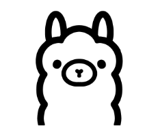

[Ollama](https://ollama.com/) allows the users to run open-source large language models, such as Llama 2, locally. Ollama bundles model weights, configuration, and data into a single package, defined by a Modelfile. It optimizes setup and configuration details, including GPU usage.

- [Ollama + AG2 instruction](https://ollama.ai/blog/openai-compatibility)

    <a className="edit-url" href="https://github.com/ag2ai/ag2/edit/main/website/docs/ecosystem/ollama.mdx" target='_blank'><Icon icon="pen" iconType="solid" size="13px"/> Edit this page</a>

