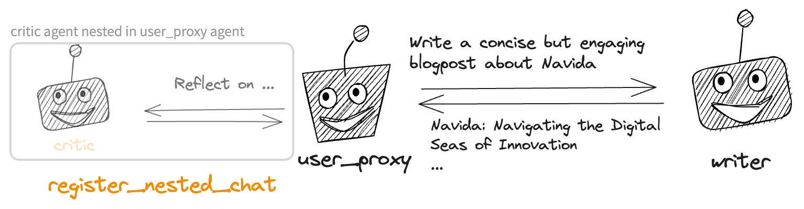
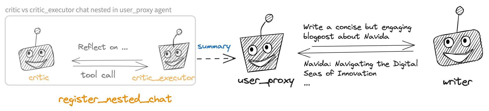

<a href="https://colab.research.google.com/github/ag2ai/ag2/blob/main/notebook/agentchat_nestedchat.ipynb" class="colab-badge" target="_blank"></a>
<a href="https://github.com/ag2ai/ag2/blob/main/notebook/agentchat_nestedchat.ipynb" class="github-badge" target="_blank"></a>


This notebook shows how you can leverage **nested chats** to solve
complex task with AG2. Nested chats is a sequence of chats created by a
receiver agent after receiving a message from a sender agent and
finished before the receiver agent replies to this message. Nested chats
allow AG2 agents to use other agents as their inner monologue to
accomplish tasks. This abstraction is powerful as it allows you to
compose agents in rich ways. This notebook shows two basic examples of
nested chat.


<div class="info Requirements">
<Info>
Install `pyautogen`:

```bash
pip install pyautogen
```

For more information, please refer to the [installation
guide](../../../../docs/user-guide/basic-concepts/installing-ag2).
</Info>
</div>

```python
from typing import Annotated

import autogen

config_list = autogen.config_list_from_json(env_or_file="OAI_CONFIG_LIST")
llm_config = {"config_list": config_list}
```


<div class="tip">
<Tip>
Learn more about the various ways to configure LLM endpoints
[here](../../../../docs/topics/llm_configuration).
</Tip>
</div>

### Example Task

Suppose we want the agents to complete the following sequence of tasks:

```python
task = """Write a concise but engaging blogpost about Navida."""
```

## Scenario 1

Let’s say we desire the following workflow to solve the task: a
user_proxy agent issues the initial query to a writer and acts as a
proxy for the user. Whenever an initial writing is provided, a critic
should be invoked to offer critique as feedback. This workflow can be
realized by a three-agent system shown below. The system includes a
user_proxy agent and a writer agent communicating with each other, with
a critic agent nested within the user_proxy agent to provide critique.
Whenever the user_proxy receives a message from the writer, it engages
in a conversation with the critic agent to work out feedback on the
writer’s message.



### Step 1. Define Agents 

Define the agents, including the outer agents writer and user_proxy, and
the inner agent critic.

```python
writer = autogen.AssistantAgent(
    name="Writer",
    llm_config={"config_list": config_list},
    system_message="""
    You are a professional writer, known for your insightful and engaging articles.
    You transform complex concepts into compelling narratives.
    You should improve the quality of the content based on the feedback from the user.
    """,
)

user_proxy = autogen.UserProxyAgent(
    name="User",
    human_input_mode="NEVER",
    is_termination_msg=lambda x: x.get("content", "").find("TERMINATE") >= 0,
    code_execution_config={
        "last_n_messages": 1,
        "work_dir": "tasks",
        "use_docker": False,
    },  # Please set use_docker=True if docker is available to run the generated code. Using docker is safer than running the generated code directly.
)

critic = autogen.AssistantAgent(
    name="Critic",
    llm_config={"config_list": config_list},
    system_message="""
    You are a critic, known for your thoroughness and commitment to standards.
    Your task is to scrutinize content for any harmful elements or regulatory violations, ensuring
    all materials align with required guidelines.
    For code
    """,
)
```

### Step 2: Orchestrate Nested Chats to Solve Tasks

```python
def reflection_message(recipient, messages, sender, config):
    print("Reflecting...", "yellow")
    return f"Reflect and provide critique on the following writing. \n\n {recipient.chat_messages_for_summary(sender)[-1]['content']}"


user_proxy.register_nested_chats(
    [{"recipient": critic, "message": reflection_message, "summary_method": "last_msg", "max_turns": 1}],
    trigger=writer,  # condition=my_condition,
)

res = user_proxy.initiate_chat(recipient=writer, message=task, max_turns=2, summary_method="last_msg")
```

## Scenarios 2

Let’s say we desire the following workflow to solve the task. Compared
to scenario 1, we want to include an additional `critic_executor` agent
to chat with the `critic` and execute some tool calls involved in the
chat. For example, a tool for detecting harmful content in the output of
the writer.

This workflow can be realized by a four-agent system shown below. The
system includes a user_proxy agent and a writer agent communicating with
each other, with a chat between the `critic` and `critic_executor` agent
nested within the `user_proxy` agent to provide critique. Whenever the
user_proxy receives a message from the writer, it engages in a
conversation between `critic` and `critic_executor` to work out feedback
on the writer’s message. A summary of the nested conversation will be
passed to the user_proxy, which will then be passed to the writer as
feedback.



```python
critic_executor = autogen.UserProxyAgent(
    name="Critic_Executor",
    human_input_mode="NEVER",
    # is_termination_msg=lambda x: x.get("content", "").find("TERMINATE") >= 0,
    code_execution_config={
        "last_n_messages": 1,
        "work_dir": "tasks",
        "use_docker": False,
    },  # Please set use_docker=True if docker is available to run the generated code. Using docker is safer than running the generated code directly.
)

# one way of registering functions is to use the register_for_llm and register_for_execution decorators


@critic_executor.register_for_execution()
@critic.register_for_llm(name="check_harmful_content", description="Check if content contain harmful keywords.")
def check_harmful_content(content: Annotated[str, "Content to check if harmful keywords."]):
    # List of harmful keywords for demonstration purposes
    harmful_keywords = ["violence", "hate", "bullying", "death"]

    # Normalize the input text to lower case to ensure case-insensitive matching
    text = content.lower()

    print(f"Checking for harmful content...{text}", "yellow")
    # Check if any of the harmful keywords appear in the text
    for keyword in harmful_keywords:
        if keyword in text:
            return "Denied. Harmful content detected:" + keyword  # Harmful content detected

    return "Approve. TERMINATE"  # No harmful content detected


def reflection_message_no_harm(recipient, messages, sender, config):
    print("Reflecting...", "yellow")
    return f"Reflect and provide critique on the following writing. Ensure it does not contain harmful content. You can use tools to check it. \n\n {recipient.chat_messages_for_summary(sender)[-1]['content']}"


user_proxy.register_nested_chats(
    [
        {
            "sender": critic_executor,
            "recipient": critic,
            "message": reflection_message_no_harm,
            "max_turns": 2,
            "summary_method": "last_msg",
        }
    ],
    trigger=writer,  # condition=my_condition,
)

res = user_proxy.initiate_chat(recipient=writer, message=task, max_turns=2, summary_method="last_msg")
```

<div className="edit-url-container">
    <a className="edit-url" href="https://github.com/ag2ai/ag2/edit/main/notebook/agentchat_nestedchat.ipynb" target='_blank'><Icon icon="pen" iconType="solid" size="13px"/> Edit this page</a>
</div>
