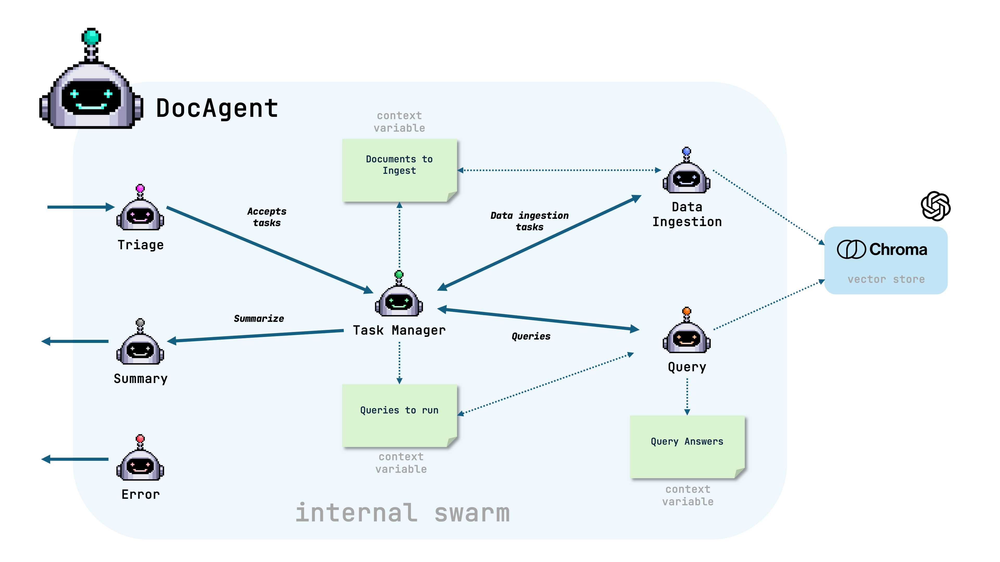

<a href="https://colab.research.google.com/github/ag2ai/ag2/blob/main/notebook/agents_docagent.ipynb" class="colab-badge" target="_blank"></a>
<a href="https://github.com/ag2ai/ag2/blob/main/notebook/agents_docagent.ipynb" class="github-badge" target="_blank"></a>


In this notebook, see how DocAgent, through natural language, can

1.  Ingest documents from a local file or URL
2.  and answer questions with RAG capability

### Installation

To get started with the document agent integration in AG2, follow these
steps:

Install AG2 with the `rag` extra:

```bash
pip install ag2[rag]
```

Notes:

1.  DocAgent only queries ingested documents, this ensures that it won’t
    make up information if it can’t find it.
2.  Answers may not be accurate for documents that cannot be parsed
    correctly to Markdown format.

You’re all set! Now you can start using DocAgent feature in AG2.

## Documents supported

The following documents can be ingested: - PDF - IMAGE - DOCX - HTML -
PPTX - ASCIIDOC - MD

You can also have the DocAgent use a web page by giving it a URL to
ingest.

## Inside the DocAgent



Before jumping into the code, let’s have a look at the swarm inside the
DocAgent.

The swarm contains the following agents:

-   **Triage Agent**: Decides what type of task to perform from user
    requests.
-   **Task Manager Agent**: Manages the tasks and initiates actions.
-   **Data Ingestion Agent**: Ingests the documents.
-   **Query Agent**: Answers user questions based on ingested documents.
-   **Error Agent**: If anything fails, the error agent will report the
    problem back.
-   **Summary Agent**: Generates a summary of the completed tasks.

When it is the DocAgent’s turn to reply, the DocAgent initializes the
agents and sets up the context variables, then:

1.  **Triage User Requests**: The `Triage Agent` categorizes the tasks
    into ingestions and queries.
2.  **Task Management**: The `Task Manager Agent` manages the tasks and
    ensures they are executed in the correct sequence.
3.  **Data Ingestion**: The `Data Ingestion Agent` processes any
    document ingesting tasks.
4.  **Query Execution**: The `Query Agent` answers any user queries.
5.  **Summary Generation**: The `Summary Agent` generates a summary of
    the completed tasks.

The swarm is dynamic in that if only a data ingestation task is
required, it will do that. Similarly for queries. This allows you to use
the DocAgent many times covering the needs of ingesting, querying, or
doing both at the same time.

## Code example

```python
import os

import autogen
from autogen import AfterWorkOption, ConversableAgent, initiate_swarm_chat
from autogen.agents.experimental import DocAgent
```


```python
# Load configuration from the OAI_CONFIG_LIST file, requires the api_key to exist in the configuration
config_list = autogen.config_list_from_json(
    "../OAI_CONFIG_LIST",
    filter_dict={
        "model": ["gpt-4o"],
    },
)

# Set the OPENAI_API_KEY from the configuration so that the internal ingestion can use it
os.environ["OPENAI_API_KEY"] = config_list[0]["api_key"]

llm_config = {
    "config_list": config_list,
}
```

### Ingesting local documents and answering questions

```python
# Create a document agent and ask them to ingest the document and answer the question
document_agent = DocAgent(llm_config=llm_config, collection_name="toast_report")
document_agent.run(
    "could you ingest ../test/agentchat/contrib/graph_rag/Toast_financial_report.pdf? What is the fiscal year 2024 financial summary?",
    max_turns=1,
)
```

### Fetching a webpage and answering questions

```python
# Create a document agent and ask them to summarize a web page article
document_agent = DocAgent(llm_config=llm_config, collection_name="news_reports")
document_agent.run(
    "could you read 'https://www.independent.co.uk/space/earth-core-inner-shape-change-b2695585.html' and summarize the article?",
    max_turns=1,
)
```

## Multiple DocAgents in a Swarm

Now we’re going to use multiple DocAgents, each responsible for their
own data.

An nvidia_agent agent will ingest NVIDIA’s financial report and query
it. Similarly, an amd_agent will do the same with AMD’s financial
report.

Although a single agent could ingest and query the documents, we want to
ensure that their queries aren’t tainted by the other company’s
documents. So we keep them separate and give them a unique
`collection_name` which, in turn, will create individual data stores
(See more on [Chroma
collections](https://cookbook.chromadb.dev/core/collections/)).

```python
# Ensure the OPENAI_API_KEY is set in the environment
llm_config = {"model": "gpt-4o-mini", "api_type": "openai", "cache_seed": None}

# Create agents for the NVIDIA and AMD documents
# Each agent has a unique collection_name so that data and queries are run in different vector store spaces
nvidia_agent = DocAgent(
    name="nvidia_agent",
    llm_config=llm_config,
    collection_name="nvidia-demo",
)

amd_agent = DocAgent(
    name="amd_agent",
    llm_config=llm_config,
    collection_name="amd-demo",
)

# A financial analyst agent who will direct the DocAgents to ingest documents and answer questions
# The financial analyst will also summarize the results and terminate the conversation
analyst = ConversableAgent(
    name="financial_analyst",
    system_message=(
        "You are a financial analyst working with two specialist agents, amd_agent who handles all AMD documents and queries, and nvidia_agent who handles all NVIDIA documents and queries. "
        "Each agent knows how to load documents and answer questions from the document regarding their respective companies. "
        "Only mention one of the two agents at a time, prioritize amd_agent. You will be able to engage each agent separately in subsequent iterations. "
        "CRITICAL - Work with ONLY ONE agent at a time and provide (a) an indication for them to take action by saying '[Next to speak is ...]' together with (b) documents they need to ingest and (c) queries they need to run, if any. "
        "DO NOT provide instructions that include the mention of both agents in the one response. "
        "When all documents have been ingested and all queries have been answered, provide a summary and add 'TERMINATE' to the end of your summary. "
        "The summary should contain detailed bullet points (multiple per query if needed) and grouped by each query. After the summary provide a one line conclusion. "
        "Add the term '(This is not financial advice)' at the end of your conclusion. "
        "If there are errors, list them and say 'TERMINATE'. "
        "If there are no errors, do not say 'TERMINATE' until each agent has run their queries and provided their answers."
    ),
    is_termination_msg=lambda x: x.get("content", "") and "terminate" in x.get("content", "").lower(),
    llm_config=llm_config,
)

# Initiate the swarm (change the file paths in the messages if needed)
result, _, _ = initiate_swarm_chat(
    initial_agent=analyst,
    agents=[analyst, nvidia_agent, amd_agent],
    messages=(
        "Use the amd_agent to load AMD's 4th quarter 2024 report from "
        "./docagent/AMDQ4-2024.pdf "
        "and use the nvidia_agent to load NVIDIA's 3rd quarter 2025 report from "
        "./docagent/NVIDIAQ3-2025.pdf. "
        "Ask 'amd_agent' to ingest the AMD document and answer two queries (a) what AMD did in regards to AI and (b) what was the Q4 2024 GAAP revenue."
        "Ask 'nvidia_agent' to ingest the NVIDIA document and answer two queries (a) what NVIDIA did in regards to AI and (b) what was Q3 2025 GAAP revenue."
    ),
    swarm_manager_args={
        "llm_config": llm_config,
        "system_message": "You are managing a financial analyst and two specialist company agents. After amd_agent or nvidia_agent, select the financial_analyst to speak next.",
        "is_termination_msg": lambda x: x.get("content", "") and "terminate" in x.get("content", "").lower(),
    },
    after_work=AfterWorkOption.SWARM_MANAGER,
)
```

### Tips for DocAgent

-   When asking for information from ingested information, be precise.
    For example, asking for revenue for the quarter in the previous
    example could retrieve a number of different revenue values, so we
    ask for “GAAP revenue” for the specific quarter.
-   If you have ingested documents in previous runs and just need to
    query the information, be clear to the DocAgent that they don’t need
    to ingest documents you refer to.
-   Ensure that any files to be ingested can be accessed by the process
    you are running.
-   Ingestions take time, be sure to use `collection_name` to reuse
    collections that have already had the documents ingested in to.
-   You can review the Markdown files ingested in the `parsed_docs`
    folder to see how effective the conversion to Markdown was. This
    will help you investigate any query issues.

<div className="edit-url-container">
    <a className="edit-url" href="https://github.com/ag2ai/ag2/edit/main/notebook/agents_docagent.ipynb" target='_blank'><Icon icon="pen" iconType="solid" size="13px"/> Edit this page</a>
</div>
