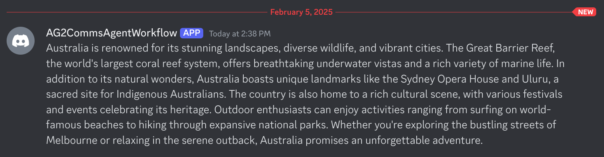
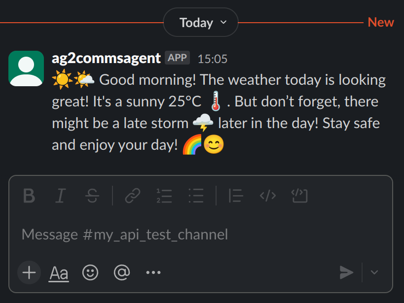

<a href="https://colab.research.google.com/github/ag2ai/ag2/blob/main/notebook/tools_commsplatforms.ipynb" class="colab-badge" target="_blank"></a>
<a href="https://github.com/ag2ai/ag2/blob/main/notebook/tools_commsplatforms.ipynb" class="github-badge" target="_blank"></a>


In this notebook we introduce send and retrieve message tools for 3
messaging platforms: Discord, Slack, and Telegram.

These tools can be added to your AG2 agents, enabling them to send
messages during a workflow and/or retrieve messages for use by the
workflow.

There are two types of tools, with one for each platform:

-   Sending a message (`DiscordSendTool`, `SlackSendTool`,
    `TelegramSendTool`)
-   Retrieving messages (`DiscordRetrieveTool`, `SlackRetrieveTool`,
    `TelegramRetrieveTool`)

You can attach one or more of them to an agent, though it may be most
typical that you create an agent for each platform and attach their
respective send and/or retrieve tools. This would allow you to tailor
your system message for your agent to the messaging style used for the
platform.


<div class="note">
<Note>
These tools are currently in our `experimental` namespace, indicating that we have tested the functionality but they have not been confirmed for use in production. Please use them with that in mind and we appreciate any feedback on them.

If you do find any bugs please [log an issue](https://github.com/ag2ai/ag2/issues) in the AG2 repository. If you would like to add more tools or functionality, we would love your [contribution](https://docs.ag2.ai/docs/contributor-guide/contributing).
</Note>
</div>


## Installation

Each messaging platform requires installation of a package specifically
for that platform.

To use the Discord tools install AG2 with the `commsagent-discord`
extra:

```bash
pip install ag2[commsagent-discord]
```

Similarly, for slack and telegram:

```bash
pip install ag2[commsagent-slack]
```

and

```bash
pip install ag2[commsagent-telegram]
```

You’re all set! Now you can start sending to and retrieving messages
from these platforms.

### LLM Configuration

The examples in this notebook will use OpenAI’s `GPT-4o mini` model. As
OpenAI is the default model provider in AG2 and the `OPENAI_API_TOKEN`
will be retrieved from environment variables, we can use an LLM
configuration as follows:

```python
llm_config = {"model": "gpt-4o-mini"}
```

For further information on LLM configurations and how to set your
environment variables up, check out our [Basic Concepts
guide](https://docs.ag2.ai/docs/user-guide/basic-concepts/llm-configuration).

### Protecting details from the LLM

These tools utilise dependency injection to protect your authentication
and channel/group details from being sent to the LLM.

For more about AG2’s dependency injection, see [this
notebook](https://docs.ag2.ai/docs/use-cases/notebooks/notebooks/tools_dependency_injection).

## Discord Send/Retrieve Messages

### Tokens, Guilds, and Channels

The Discord tools, `DiscordSendTool` and `DiscordRetrieveTool`, require
authentication (bot token), server (guild name), and channel details in
order to send/retrieve messages.

Here are some references to help you establish those details:

-   [Creating a Bot
    Account](https://discordpy.readthedocs.io/en/latest/discord.html),
    and [another
    reference](https://gist.github.com/SinisterRectus/2d84025f51bc0be37d2f0d0c559c2e35#how-do-i-make-a-discord-bot)
-   [Adding a Bot to a
    server](https://gist.github.com/SinisterRectus/2d84025f51bc0be37d2f0d0c559c2e35#how-do-i-add-a-discord-bot-to-my-server)
-   Bot Permissions you will need:
    -   General Permissions: View Channels
    -   Text Permissions: Send Messages, Read Message History, Use Slash
        Commands
-   Server/Guild Name - Right-click the Server \> Server Settings \>
    Overview, see the Server Name at the top right (e.g. “My Test
    Server”)
-   Channel name - The text after the hash (e.g. “general”)

### Sending and retrieving messages with Discord

Let’s add the Discord Send and Retrieve tools to an agent and have them
executed by another agent in a simple 2-agent chat.

```python
# Tools are available in the autogen.tools namespace
from autogen import ConversableAgent
from autogen.tools.experimental import DiscordRetrieveTool, DiscordSendTool

llm_config = {"model": "gpt-4o-mini"}
```

Create our two agents.

```python
# Our tool executor agent, which will run the tools once recommended by the discord_agent, no LLM required
executor_agent = ConversableAgent(
    name="executor_agent",
    human_input_mode="NEVER",
)

# Our discord agent, who will construct messages and recommend the tool calls
discord_agent = ConversableAgent(
    name="discord_agent",
    llm_config=llm_config,
)
```

Prepare our authentication, server/guild, channel details, then create
our tools, and finally register them with the agents.

```python
_bot_token = "MTMyOTI..."  # Discord bot token
_guild_name = "My Test Server"  # Name of the server
_channel_name = "general"  # Name of the channel, this is equivalent to "# general"

# Create our send tool
discord_send_tool = DiscordSendTool(bot_token=_bot_token, guild_name=_guild_name, channel_name=_channel_name)

# Register it for recommendation by our Discord agent
discord_send_tool.register_for_llm(discord_agent)

# Register it for execution by our executor agent
discord_send_tool.register_for_execution(executor_agent)

# And the same for our our retrieve tool
discord_retrieve_tool = DiscordRetrieveTool(bot_token=_bot_token, guild_name=_guild_name, channel_name=_channel_name)
discord_retrieve_tool.register_for_llm(discord_agent)
discord_retrieve_tool.register_for_execution(executor_agent)
```

Let’s send a message to Discord, all about the wonders of Australia.

We’ll limit it to 2 turns, allowing the Discord agent to receive the
request, construct and recommend the send tool, and then the executor
agent to execute the tool, sending the message to Discord.

```python
executor_agent.initiate_chat(
    recipient=discord_agent,
    message="Let's send a message to Discord giving them a paragraph on the highlights of Australia.",
    max_turns=2,
)
```

And here’s the message it sent:



And the output:

```console
executor_agent (to discord_agent):

Let's send a message to Discord giving them a paragraph on the highlights of Australia.

--------------------------------------------------------------------------------

>>>>>>>> USING AUTO REPLY...
discord_agent (to executor_agent):

***** Suggested tool call (call_iLjFWjeDcUt3jEC7JIeU79Kq): discord_send *****
Arguments: 
{"message":"Australia is renowned for its stunning landscapes, diverse wildlife, and vibrant cities. The Great Barrier Reef, the world's largest coral reef system, offers breathtaking underwater vistas and a rich variety of marine life. In addition to its natural wonders, Australia boasts unique landmarks like the Sydney Opera House and Uluru, a sacred site for Indigenous Australians. The country is also home to a rich cultural scene, with various festivals and events celebrating its heritage. Outdoor enthusiasts can enjoy activities ranging from surfing on world-famous beaches to hiking through expansive national parks. Whether you're exploring the bustling streets of Melbourne or relaxing in the serene outback, Australia promises an unforgettable adventure."}
*****************************************************************************

--------------------------------------------------------------------------------

>>>>>>>> EXECUTING FUNCTION discord_send...
Call ID: call_iLjFWjeDcUt3jEC7JIeU79Kq
Input arguments: {'message': "Australia is renowned for its stunning landscapes, diverse wildlife, and vibrant cities. The Great Barrier Reef, the world's largest coral reef system, offers breathtaking underwater vistas and a rich variety of marine life. In addition to its natural wonders, Australia boasts unique landmarks like the Sydney Opera House and Uluru, a sacred site for Indigenous Australians. The country is also home to a rich cultural scene, with various festivals and events celebrating its heritage. Outdoor enthusiasts can enjoy activities ranging from surfing on world-famous beaches to hiking through expansive national parks. Whether you're exploring the bustling streets of Melbourne or relaxing in the serene outback, Australia promises an unforgettable adventure."}
executor_agent (to discord_agent):

***** Response from calling tool (call_iLjFWjeDcUt3jEC7JIeU79Kq) *****
Message sent successfully (ID: 1336541434672844870):
Australia is renowned for its stunning landscapes, diverse wildlife, and vibrant cities. The Great Barrier Reef, the world's largest coral reef system, offers breathtaking underwater vistas and a rich variety of marine life. In addition to its natural wonders, Australia boasts unique landmarks like the Sydney Opera House and Uluru, a sacred site for Indigenous Australians. The country is also home to a rich cultural scene, with various festivals and events celebrating its heritage. Outdoor enthusiasts can enjoy activities ranging from surfing on world-famous beaches to hiking through expansive national parks. Whether you're exploring the bustling streets of Melbourne or relaxing in the serene outback, Australia promises an unforgettable adventure.
**********************************************************************

--------------------------------------------------------------------------------

>>>>>>>> USING AUTO REPLY...
discord_agent (to executor_agent):

The message about the highlights of Australia has been successfully sent to Discord. If you need anything else, feel free to ask!

--------------------------------------------------------------------------------
```

Let’s now retrieve the last two messages from the channel, this will
include the message we sent as well as a previous one.

```python
executor_agent.initiate_chat(
    recipient=discord_agent,
    message="Tell me which countries the last two messages on my Discord channel are about and the main differences.",
    max_turns=2,
)
```

Output:

```console
executor_agent (to discord_agent):

Tell me which countries the last two messages on my Discord channel are about and the main differences.

--------------------------------------------------------------------------------

>>>>>>>> USING AUTO REPLY...
discord_agent (to executor_agent):

***** Suggested tool call (call_slGKL1HRJfcCb3kNsmd0JcC0): discord_retrieve *****
Arguments: 
{"maximum_messages":2}
*********************************************************************************

--------------------------------------------------------------------------------

>>>>>>>> EXECUTING FUNCTION discord_retrieve...
Call ID: call_slGKL1HRJfcCb3kNsmd0JcC0
Input arguments: {'maximum_messages': 2}
executor_agent (to discord_agent):

***** Response from calling tool (call_slGKL1HRJfcCb3kNsmd0JcC0) *****
[{'id': '1336541434672844870', 'content': "Australia is renowned for its stunning landscapes, diverse wildlife, and vibrant cities. The Great Barrier Reef, the world's largest coral reef system, offers breathtaking underwater vistas and a rich variety of marine life. In addition to its natural wonders, Australia boasts unique landmarks like the Sydney Opera House and Uluru, a sacred site for Indigenous Australians. The country is also home to a rich cultural scene, with various festivals and events celebrating its heritage. Outdoor enthusiasts can enjoy activities ranging from surfing on world-famous beaches to hiking through expansive national parks. Whether you're exploring the bustling streets of Melbourne or relaxing in the serene outback, Australia promises an unforgettable adventure.", 'author': 'AG2CommsAgentWorkflow#8931', 'timestamp': '2025-02-05T03:38:29.765000+00:00'}, {'id': '1336186020642951312', 'content': "🇯🇵 **Discover Japan: A Blend of Tradition and Modernity!** 🌸  \n\nJapan is a fascinating country where ancient traditions coexist with cutting-edge technology. From bustling cities like Tokyo to serene temples in Kyoto, there's something for everyone! 🏯🚄  \n\n**Did you know?**  \n- Japan has the world's oldest continuously operating company, established in 578 AD! 🏢  \n- It's home to the famous cherry blossoms, which attract millions each spring! 🌸  \n- Japanese cuisine, including sushi and ramen, is loved worldwide! 🍣🍜  \n\nWhat’s your favorite thing about Japan? Share your thoughts below! 👇", 'author': 'AG2CommsAgentWorkflow#8931', 'timestamp': '2025-02-04T04:06:12.457000+00:00'}]
**********************************************************************

--------------------------------------------------------------------------------

>>>>>>>> USING AUTO REPLY...
discord_agent (to executor_agent):

The last two messages in your Discord channel are about Australia and Japan. Here are the main differences between the two countries based on the content of the messages:

### Australia
- Noted for its **stunning landscapes** and **diverse wildlife**.
- Highlights the **Great Barrier Reef**, a natural wonder and the world's largest coral reef system.
- Features unique landmarks like the **Sydney Opera House** and **Uluru**, which is significant for Indigenous Australians.
- Celebrates a **rich cultural scene** with various festivals and events.
- Provides outdoor activities such as **surfing** and **hiking** through national parks.
- Offers a mix of urban life in cities like **Melbourne** and adventures in the **outback**.

### Japan
- Known for its interesting blend of **ancient traditions** and **modern technology**.
- Features bustling cities like **Tokyo** alongside serene locations like **Kyoto** with its temples.
- Notable facts include the world's oldest continuously operating company and its famous **cherry blossoms**.
- Japanese cuisine, especially **sushi** and **ramen**, is widely cherished around the world.
- Engages visitors with a call to share personal favorites about Japan, emphasizing community interaction.

In summary, while Australia emphasizes natural beauty and outdoor adventures, Japan focuses on the coexistence of tradition and modernity, along with cultural and culinary significance.

--------------------------------------------------------------------------------
```

## Slack Send/Retrieve Messages

### Tokens and Channels

The Slack tools, `SlackSendTool` and `SlackRetrieveTool`, require
authentication (OAuth token) and channel details in order to
send/retrieve messages.

Here are the steps to get a token:

-   Create an app, from scratch, at https://api.slack.com/apps
-   In your app settings, go to Features \> OAuth & Permissions:
    -   Under “Bot Token Scopes”, add these permissions:
        -   chat:write (to send messages)
        -   channels:history
        -   channels:read (to access channel info)
        -   groups:read (for private channels)
        -   im:read (for direct messages)
        -   users:read (to get user info)
        -   files:read (to access file attachments)
        -   groups:history
        -   im:history
        -   mpim:history
-   With your app setup, now install it in your workspace, using the
    “Install App” menu, to create an OAuth Token.

To get the ID for your channel:

-   Open Slack in a browser
-   Navigate to your channel
-   Get the channel ID from the URL (e.g., …/C12345678)

Finally you need to add the bot to your channel:

-   In Slack, go to your channel
-   Type `/invite @YourBotName`, e.g. `/invite @ag2commsagent`

Now you should be good to go with your OAuth token, channel ID, and a
bot on your channel ready to send and retrieve messages!

### Sending and retrieving messages with Slack

Let’s add the Slack Send and Retrieve tools to an agent and have them
executed by another agent in as simple 2-agent chat.

This time, we’ll include a weather tool so that we can send a weather
forecast.

```python
# Tools are available in the autogen.tools namespace
from autogen import ConversableAgent, register_function
from autogen.tools.experimental import SlackRetrieveTool, SlackSendTool

llm_config = {"model": "gpt-4o-mini"}
```

Create our two agents.

```python
# Our tool executor agent, which will run the tools once recommended by the slack_agent, no LLM required
executor_agent = ConversableAgent(
    name="executor_agent",
    human_input_mode="NEVER",
)

slack_agent = ConversableAgent(
    name="slack_agent",
    llm_config=llm_config,
)
```

Prepare our authentication and channel details, then create our tools,
and finally register them with the agents.

```python
_bot_token = "xoxo..."  # OAuth token
_channel_id = "C1234567"  # ID of the Slack channel

# Create our send tool
slack_send_tool = SlackSendTool(bot_token=_bot_token, channel_id=_channel_id)

# Register it for recommendation by our Slack agent
slack_send_tool.register_for_llm(slack_agent)

# Register it for execution by our executor agent
slack_send_tool.register_for_execution(executor_agent)

# And the same for our our retrieve tool
slack_retrieve_tool = SlackRetrieveTool(bot_token=_bot_token, channel_id=_channel_id)
slack_retrieve_tool.register_for_llm(slack_agent)
slack_retrieve_tool.register_for_execution(executor_agent)
```

Here’s our weather tool and we’ll register it to the two agents, but
this time using the `register_function` method to do it in one go.

```python
# Weather function
def get_weather():
    return "The weather today is 25 degrees Celsius and sunny, with a late storm."


register_function(
    get_weather,
    caller=slack_agent,
    executor=executor_agent,
    description="Get the current weather forecast",
)
```

Let’s send a message to Slack, giving everyone a weather forecast for
today.

We’ll limit it to 3 turns, allowing the Slack agent to receive the
request, recommend the weather tool, and go around the agents and then
construct and recommend the send tool. The executor agent will execute
each tool request.

```python
executor_agent.initiate_chat(
    recipient=slack_agent,
    message="Get the latest weather forecast and send it to our Slack channel. Use some emojis to make it fun!",
    max_turns=3,
)
```

And here’s the message it sent:



And the output:

```console
executor_agent (to slack_agent):

Get the latest weather forecast and send it to our Slack channel. Use some emojis to make it fun!

--------------------------------------------------------------------------------

>>>>>>>> USING AUTO REPLY...
slack_agent (to executor_agent):

***** Suggested tool call (call_PCE5cFUXFJ0jFCRj4Zva0yP8): get_weather *****
Arguments: 
{}
****************************************************************************

--------------------------------------------------------------------------------

>>>>>>>> EXECUTING FUNCTION get_weather...
Call ID: call_PCE5cFUXFJ0jFCRj4Zva0yP8
Input arguments: {}
executor_agent (to slack_agent):

***** Response from calling tool (call_PCE5cFUXFJ0jFCRj4Zva0yP8) *****
The weather today is 25 degrees Celsius and sunny, with a late storm.
**********************************************************************

--------------------------------------------------------------------------------

>>>>>>>> USING AUTO REPLY...
slack_agent (to executor_agent):

***** Suggested tool call (call_IdyhjnQ5YGhxfjbDAyKqy1nb): slack_send *****
Arguments: 
{"message":"☀️🌤️ Good morning! The weather today is looking great! It's a sunny 25°C 🌡️. But don’t forget, there might be a late storm 🌩️ later in the day! Stay safe and enjoy your day! 🌈😊"}
***************************************************************************

--------------------------------------------------------------------------------

>>>>>>>> EXECUTING FUNCTION slack_send...
Call ID: call_IdyhjnQ5YGhxfjbDAyKqy1nb
Input arguments: {'message': "☀️🌤️ Good morning! The weather today is looking great! It's a sunny 25°C 🌡️. But don’t forget, there might be a late storm 🌩️ later in the day! Stay safe and enjoy your day! 🌈😊"}
executor_agent (to slack_agent):

***** Response from calling tool (call_IdyhjnQ5YGhxfjbDAyKqy1nb) *****
Message sent successfully (ID: 1738728329.265739):
☀️🌤️ Good morning! The weather today is looking great! It's a sunny 25°C 🌡️. But don’t forget, there might be a late storm 🌩️ later in the day! Stay safe and enjoy your day! 🌈😊
**********************************************************************

--------------------------------------------------------------------------------

>>>>>>>> USING AUTO REPLY...
slack_agent (to executor_agent):

I've sent the latest weather forecast to your Slack channel! Here's the message: 

☀️🌤️ Good morning! The weather today is looking great! It's a sunny 25°C 🌡️. But don’t forget, there might be a late storm 🌩️ later in the day! Stay safe and enjoy your day! 🌈😊

--------------------------------------------------------------------------------
```

Let’s now retrieve the last 5 messages to give a picture of the weather
for the last week.

```python
executor_agent.initiate_chat(
    recipient=slack_agent,
    message="Get the last 5 messages about daily weather from our Slack channel and give me a summary of the week's weather.",
    max_turns=2,
)
```

Output:

```console
executor_agent (to slack_agent):

Get the last 5 messages about daily weather from our Slack channel and give me a summary of the week's weather.

--------------------------------------------------------------------------------

>>>>>>>> USING AUTO REPLY...
slack_agent (to executor_agent):

***** Suggested tool call (call_NDb8KJXEAdsetPvYvXkM6BKM): slack_retrieve *****
Arguments: 
{"maximum_messages":5}
*******************************************************************************

--------------------------------------------------------------------------------

>>>>>>>> EXECUTING FUNCTION slack_retrieve...
Call ID: call_NDb8KJXEAdsetPvYvXkM6BKM
Input arguments: {'maximum_messages': 5}
executor_agent (to slack_agent):

***** Response from calling tool (call_NDb8KJXEAdsetPvYvXkM6BKM) *****
{'message_count': 5, 'messages': [{'user': 'U088V1NKK3R', 'type': 'message', 'ts': '1738728764.548459', 'bot_id': 'B089C36A1B6', 'app_id': 'A0892UE22GN', 'text': ":sun_with_face: Good morning, everyone! Today's weather is a sizzling 30°C! :sunny::fire: Stay hydrated and take care, especially with the high fire danger. :ocean::no_entry_sign: Let's keep it safe out there!", 'team': 'T088N5HLRTR', 'bot_profile': {'id': 'B089C36A1B6', 'deleted': False, 'name': 'ag2commsagent', 'updated': 1737225262, 'app_id': 'A0892UE22GN', 'icons': {'image_36': 'https://a.slack-edge.com/80588/img/plugins/app/bot_36.png', 'image_48': 'https://a.slack-edge.com/80588/img/plugins/app/bot_48.png', 'image_72': 'https://a.slack-edge.com/80588/img/plugins/app/service_72.png'}, 'team_id': 'T088N5HLRTR'}, 'blocks': [{'type': 'rich_text', 'block_id': '6gpG', 'elements': [{'type': 'rich_text_section', 'elements': [{'type': 'emoji', 'name': 'sun_with_face', 'unicode': '1f31e'}, {'type': 'text', 'text': " Good morning, everyone! Today's weather is a sizzling 30°C! "}, {'type': 'emoji', 'name': 'sunny', 'unicode': '2600-fe0f'}, {'type': 'emoji', 'name': 'fire', 'unicode': '1f525'}, {'type': 'text', 'text': ' Stay hydrated and take care, especially with the high fire danger. '}, {'type': 'emoji', 'name': 'ocean', 'unicode': '1f30a'}, {'type': 'emoji', 'name': 'no_entry_sign', 'unicode': '1f6ab'}, {'type': 'text', 'text': " Let's keep it safe out there!"}]}]}]}, {'user': 'U088V1NKK3R', 'type': 'message', 'ts': '1738728751.427209', 'bot_id': 'B089C36A1B6', 'app_id': 'A0892UE22GN', 'text': ":mostly_sunny: Hey team! Today's weather forecast is in: It's a chilly 10°C with some strong cold winds! :cold_face: Don't forget to wrap up warm! :scarf::coffee:", 'team': 'T088N5HLRTR', 'bot_profile': {'id': 'B089C36A1B6', 'app_id': 'A0892UE22GN', 'name': 'ag2commsagent', 'icons': {'image_36': 'https://a.slack-edge.com/80588/img/plugins/app/bot_36.png', 'image_48': 'https://a.slack-edge.com/80588/img/plugins/app/bot_48.png', 'image_72': 'https://a.slack-edge.com/80588/img/plugins/app/service_72.png'}, 'deleted': False, 'updated': 1737225262, 'team_id': 'T088N5HLRTR'}, 'blocks': [{'type': 'rich_text', 'block_id': 'frMN', 'elements': [{'type': 'rich_text_section', 'elements': [{'type': 'emoji', 'name': 'mostly_sunny', 'unicode': '1f324-fe0f'}, {'type': 'text', 'text': " Hey team! Today's weather forecast is in: It's a chilly 10°C with some strong cold winds! "}, {'type': 'emoji', 'name': 'cold_face', 'unicode': '1f976'}, {'type': 'text', 'text': " Don't forget to wrap up warm! "}, {'type': 'emoji', 'name': 'scarf', 'unicode': '1f9e3'}, {'type': 'emoji', 'name': 'coffee', 'unicode': '2615'}]}]}]}, {'user': 'U088V1NKK3R', 'type': 'message', 'ts': '1738728738.219479', 'bot_id': 'B089C36A1B6', 'app_id': 'A0892UE22GN', 'text': ":rain_cloud::umbrella_with_rain_drops: Good morning, everyone! Today's weather forecast is: \n\n:thermometer: **20°C** \n:cloud: Early storm with clearing showers later! \n\nDon't forget your umbrella! :rainbow::blush:", 'team': 'T088N5HLRTR', 'bot_profile': {'id': 'B089C36A1B6', 'app_id': 'A0892UE22GN', 'name': 'ag2commsagent', 'icons': {'image_36': 'https://a.slack-edge.com/80588/img/plugins/app/bot_36.png', 'image_48': 'https://a.slack-edge.com/80588/img/plugins/app/bot_48.png', 'image_72': 'https://a.slack-edge.com/80588/img/plugins/app/service_72.png'}, 'deleted': False, 'updated': 1737225262, 'team_id': 'T088N5HLRTR'}, 'blocks': [{'type': 'rich_text', 'block_id': 'd4Qra', 'elements': [{'type': 'rich_text_section', 'elements': [{'type': 'emoji', 'name': 'rain_cloud', 'unicode': '1f327-fe0f'}, {'type': 'emoji', 'name': 'umbrella_with_rain_drops', 'unicode': '2614'}, {'type': 'text', 'text': " Good morning, everyone! Today's weather forecast is: \n\n"}, {'type': 'emoji', 'name': 'thermometer', 'unicode': '1f321-fe0f'}, {'type': 'text', 'text': ' **20°C** \n'}, {'type': 'emoji', 'name': 'cloud', 'unicode': '2601-fe0f'}, {'type': 'text', 'text': " Early storm with clearing showers later! \n\nDon't forget your umbrella! "}, {'type': 'emoji', 'name': 'rainbow', 'unicode': '1f308'}, {'type': 'emoji', 'name': 'blush', 'unicode': '1f60a'}]}]}]}, {'user': 'U088V1NKK3R', 'type': 'message', 'ts': '1738728723.462599', 'bot_id': 'B089C36A1B6', 'app_id': 'A0892UE22GN', 'text': ":partly_sunny_rain::umbrella_with_rain_drops: Hey team! Today's weather forecast is 15°C and wet. Don't forget your umbrellas! :rain_cloud::rainbow: Stay dry! :umbrella_with_rain_drops::snowflake:", 'team': 'T088N5HLRTR', 'bot_profile': {'id': 'B089C36A1B6', 'app_id': 'A0892UE22GN', 'name': 'ag2commsagent', 'icons': {'image_36': 'https://a.slack-edge.com/80588/img/plugins/app/bot_36.png', 'image_48': 'https://a.slack-edge.com/80588/img/plugins/app/bot_48.png', 'image_72': 'https://a.slack-edge.com/80588/img/plugins/app/service_72.png'}, 'deleted': False, 'updated': 1737225262, 'team_id': 'T088N5HLRTR'}, 'blocks': [{'type': 'rich_text', 'block_id': 'LmY', 'elements': [{'type': 'rich_text_section', 'elements': [{'type': 'emoji', 'name': 'partly_sunny_rain', 'unicode': '1f326-fe0f'}, {'type': 'emoji', 'name': 'umbrella_with_rain_drops', 'unicode': '2614'}, {'type': 'text', 'text': " Hey team! Today's weather forecast is 15°C and wet. Don't forget your umbrellas! "}, {'type': 'emoji', 'name': 'rain_cloud', 'unicode': '1f327-fe0f'}, {'type': 'emoji', 'name': 'rainbow', 'unicode': '1f308'}, {'type': 'text', 'text': ' Stay dry! '}, {'type': 'emoji', 'name': 'umbrella_with_rain_drops', 'unicode': '2614'}, {'type': 'emoji', 'name': 'snowflake', 'unicode': '2744-fe0f'}]}]}]}, {'user': 'U088V1NKK3R', 'type': 'message', 'ts': '1738728329.265739', 'bot_id': 'B089C36A1B6', 'app_id': 'A0892UE22GN', 'text': ":sunny::mostly_sunny: Good morning! The weather today is looking great! It's a sunny 25°C :thermometer:. But don’t forget, there might be a late storm :lightning: later in the day! Stay safe and enjoy your day! :rainbow::blush:", 'team': 'T088N5HLRTR', 'bot_profile': {'id': 'B089C36A1B6', 'app_id': 'A0892UE22GN', 'name': 'ag2commsagent', 'icons': {'image_36': 'https://a.slack-edge.com/80588/img/plugins/app/bot_36.png', 'image_48': 'https://a.slack-edge.com/80588/img/plugins/app/bot_48.png', 'image_72': 'https://a.slack-edge.com/80588/img/plugins/app/service_72.png'}, 'deleted': False, 'updated': 1737225262, 'team_id': 'T088N5HLRTR'}, 'blocks': [{'type': 'rich_text', 'block_id': 'toH=', 'elements': [{'type': 'rich_text_section', 'elements': [{'type': 'emoji', 'name': 'sunny', 'unicode': '2600-fe0f'}, {'type': 'emoji', 'name': 'mostly_sunny', 'unicode': '1f324-fe0f'}, {'type': 'text', 'text': " Good morning! The weather today is looking great! It's a sunny 25°C "}, {'type': 'emoji', 'name': 'thermometer', 'unicode': '1f321-fe0f'}, {'type': 'text', 'text': '. But don’t forget, there might be a late storm '}, {'type': 'emoji', 'name': 'lightning', 'unicode': '1f329-fe0f'}, {'type': 'text', 'text': ' later in the day! Stay safe and enjoy your day! '}, {'type': 'emoji', 'name': 'rainbow', 'unicode': '1f308'}, {'type': 'emoji', 'name': 'blush', 'unicode': '1f60a'}]}]}]}], 'start_time': 'latest'}
**********************************************************************

--------------------------------------------------------------------------------

>>>>>>>> USING AUTO REPLY...
slack_agent (to executor_agent):

Here is a summary of the last five messages about daily weather from our Slack channel:

1. **30°C, High Fire Danger**: "Good morning! Today's weather is a sizzling 30°C! Stay hydrated and take care, especially with the high fire danger."
   
2. **10°C, Chilly with Strong Winds**: "Hey team! Today's weather forecast is in: It's a chilly 10°C with some strong cold winds! Don't forget to wrap up warm!"

3. **20°C, Early Storm**: "Good morning! Today's weather forecast is: 20°C with an early storm and clearing showers later. Don't forget your umbrella!"

4. **15°C, Wet**: "Hey team! Today's weather forecast is 15°C and wet. Don't forget your umbrellas! Stay dry!"

5. **25°C, Sunny with Late Storm**: "Good morning! The weather today is looking great at 25°C, but there might be a late storm later in the day. Stay safe and enjoy your day!"

### Summary of the Week's Weather:
- There have been fluctuations in temperatures ranging from 10°C to 30°C over the past few days.
- Weather conditions have included a mix of sunny days, chilly winds, and multiple instances of rain with early storms.
- Overall, it's important to stay hydrated and be prepared for both sun and rain, with reminders to carry umbrellas on wet days.

Let me know if you need further details!

--------------------------------------------------------------------------------
```

## Telegram Send/Retrieve Messages

### Tokens, Bots, Groups, and Channels

The Telegram tools, `TelegramSendTool` and `TelegramRetrieveTool`,
require authentication (API ID and hash) and target Bot/Group/Channel
details in order to send/retrieve messages.

The Telegram tool is different to the Discord and Slack tools in that
you can send/retrieve messages to/from a bot channel, a group channel, a
channel, or even your own private channel. This is all handled by giving
the respective ID to the `chat_id` parameter when creating the tool.

Here’s how to establish your API ID and Hash: - [API ID and
Hash](https://docs.telethon.dev/en/stable/basic/signing-in.html)

If you want to create a bot, which is optional but allows you to send
messages to the bot channel: - In Telegram, search for
(**BotFather?**) - Click on (**BotFather?**) (make sure it’s the correct
one!) and click START - Message `/newbot` - Give it a name then a
username - You’ll then receive a token for your bot and you see the
links below to get the ID for your bot

There are four types of `chat_id`s you can send to: - Bot chat - Group
chat - Channel chat - Private chat (noted in Telegram as
`Saved Messages`)

To find these the IDs for these, here are some references: - [Bot,
Private, Channel, Group
IDs](https://gist.github.com/nafiesl/4ad622f344cd1dc3bb1ecbe468ff9f8a) -
[Group and Channel
IDs](https://docs.b2core.b2broker.com/how-to-articles/manage-communication-platforms/how-to-get-telegram-chat-group-and-channel-identifiers) -
[Group
ID](https://stackoverflow.com/questions/32423837/telegram-bot-how-to-get-a-group-chat-id)

It takes a bit of time to get this sorted, but once you have your token
and IDs, you’re ready to go!


<div class="note">
<Note>
You may be prompted for Telegram verification during the AG2 chat session. This typically happens when you first run it and is not required during subsequent runs.
</Note>
</div>


### Sending and retrieving messages with Telegram

Let’s add the Telegram Send and Retrieve tools to an agent and have them
executed by another agent in as simple 2-agent chat.

```python
# Tools are available in the autogen.tools namespace
from autogen import ConversableAgent
from autogen.tools.experimental import TelegramRetrieveTool, TelegramSendTool

llm_config = {"model": "gpt-4o-mini"}
```

Create our two agents.

```python
# Our tool executor agent, which will run the tools once recommended by the telegram_agent, no LLM required
executor_agent = ConversableAgent(
    name="executor_agent",
    human_input_mode="NEVER",
)

telegram_agent = ConversableAgent(
    name="telegram_agent",
    llm_config=llm_config,
)
```

Prepare our authentication and target chat id details, then create our
tools, and finally register them with the agents.

For this send, we’ll send it to a group using the group’s ID in our
`chat_id`.

```python
# Authentication and target Chat ID (in this case a Group chat)
api_id = "123....."
api_hash = "a2e............................."
_chat_id_group = "-4712345678"

# Create our send tool
telegram_send_tool = TelegramSendTool(api_id=api_id, api_hash=api_hash, chat_id=_chat_id_group)

# Register it for recommendation by our Telegram agent
telegram_send_tool.register_for_llm(telegram_agent)

# Register it for execution by our executor agent
telegram_send_tool.register_for_execution(executor_agent)

# And the same for our our retrieve tool
telegram_retrieve_tool = TelegramRetrieveTool(api_id=api_id, api_hash=api_hash, chat_id=_chat_id_group)
telegram_retrieve_tool.register_for_llm(telegram_agent)
telegram_retrieve_tool.register_for_execution(executor_agent)
```

Let’s send a message to our Telegram channel, with a joke for the day.

We’ll limit it to 2 turns, allowing the Telegram agent to receive the
request, construct and recommend the send tool, and then the executor
agent to execute the tool, sending the message to the Telegram group.

```python
executor_agent.initiate_chat(
    recipient=telegram_agent,
    message="Let's send a message to Telegram giving them a joke for the day about AI agentic frameworks",
    max_turns=2,
)
```

And here’s the joke message it sent:


And the output:

```console
executor_agent (to telegram_agent):

Let's send a message to Telegram giving them a joke for the day about AI agentic frameworks

--------------------------------------------------------------------------------

>>>>>>>> USING AUTO REPLY...
telegram_agent (to executor_agent):

***** Suggested tool call (call_QfDyh1mP2sb6uUe6k9geRZCJ): telegram_send *****
Arguments: 
{"message":"Why did the AI agentic framework apply for a job? \n\nBecause it wanted to prove it could be more than just a 'model' citizen!"}
******************************************************************************

--------------------------------------------------------------------------------

>>>>>>>> EXECUTING FUNCTION telegram_send...
Call ID: call_QfDyh1mP2sb6uUe6k9geRZCJ
Input arguments: {'message': "Why did the AI agentic framework apply for a job? \n\nBecause it wanted to prove it could be more than just a 'model' citizen!"}
executor_agent (to telegram_agent):

***** Response from calling tool (call_QfDyh1mP2sb6uUe6k9geRZCJ) *****
Message sent successfully (ID: 98):
Why did the AI agentic framework apply for a job? 

Because it wanted to prove it could be more than just a 'model' citizen!
**********************************************************************

--------------------------------------------------------------------------------

>>>>>>>> USING AUTO REPLY...
telegram_agent (to executor_agent):

I've sent the joke to Telegram! Here's what I shared:

"Why did the AI agentic framework apply for a job? Because it wanted to prove it could be more than just a 'model' citizen!" 

If you need anything else, feel free to ask!

--------------------------------------------------------------------------------
```

Let’s now retrieve the last 10 messages and get their IDs

```python
executor_agent.initiate_chat(
    recipient=telegram_agent,
    message="Retrieve the latest 10 messages from Telegram, getting the IDs and a one sentence summary of each.",
    max_turns=2,
)
```

Output with our messages and IDs (including our joke):

```console
executor_agent (to telegram_agent):

Retrieve the latest 10 messages from Telegram, getting the IDs and a one sentence summary of each.

--------------------------------------------------------------------------------

>>>>>>>> USING AUTO REPLY...
telegram_agent (to executor_agent):

***** Suggested tool call (call_ycoRcdigyNdRZL9JYynMakAw): telegram_retrieve *****
Arguments: 
{"maximum_messages":10}
**********************************************************************************

--------------------------------------------------------------------------------

>>>>>>>> EXECUTING FUNCTION telegram_retrieve...
Call ID: call_ycoRcdigyNdRZL9JYynMakAw
Input arguments: {'maximum_messages': 10}
executor_agent (to telegram_agent):

***** Response from calling tool (call_ycoRcdigyNdRZL9JYynMakAw) *****
{'message_count': 10, 'messages': [{'id': '98', 'date': '2025-02-05T05:13:13+00:00', 'from_id': 'PeerUser(user_id=7746084224)', 'text': "Why did the AI agentic framework apply for a job? \n\nBecause it wanted to prove it could be more than just a 'model' citizen!", 'reply_to_msg_id': None, 'forward_from': None, 'edit_date': None, 'media': False, 'entities': None}, {'id': '92', 'date': '2025-02-04T04:47:38+00:00', 'from_id': 'PeerUser(user_id=7746084224)', 'text': "🇳🇿 **New Zealand** Awaits!\n\nIn a land where mountains kiss the sky,  \nAotearoa calls, where dreams can fly.  \nWith valleys green and rivers clear,  \nNature's beauty, so pristine and dear.\n\nFrom fjords of grandeur to beaches so wide,  \nThe spirit of adventure, a thrilling ride.  \nWith Maori tales and rich heritage,  \nNew Zealand's charm, a vibrant stage.\n\nKiwi birds may wander, shy and free,  \nIn this land of wonders, come explore with me!  \nWith every sunrise, a bright new start,  \nNew Zealand captures every heart!  \n\nIf you wish to know more of this magical land,  \nJoin in the journey, together we'll stand! 🌄", 'reply_to_msg_id': None, 'forward_from': None, 'edit_date': None, 'media': False, 'entities': [{'type': 'MessageEntityBold', 'offset': 5, 'length': 11}]}, {'id': '91', 'date': '2025-02-04T04:47:11+00:00', 'from_id': 'PeerUser(user_id=7746084224)', 'text': "🇬🇭 **Ghana** is a vibrant West African country known for its rich history, diverse culture, and friendly people! \n\n🌍 From the bustling markets of Accra to the serene beaches of Cape Coast, there's so much to explore. \n\n🏴\u200d☠️ Don't miss the historical forts and castles, which tell the poignant story of the transatlantic slave trade. \n\n🌿 Nature lovers can enjoy the beautiful landscapes of Kakum National Park, famous for its canopy walk.\n\n🎉 Immerse yourself in Ghanaian culture through its lively festivals, music, and delicious cuisine! \n\nIf you're interested in learning more or have questions, feel free to share! 🌟", 'reply_to_msg_id': None, 'forward_from': None, 'edit_date': None, 'media': False, 'entities': [{'type': 'MessageEntityBold', 'offset': 5, 'length': 5}]}, {'id': '90', 'date': '2025-02-04T04:46:40+00:00', 'from_id': 'PeerUser(user_id=7746084224)', 'text': "🌏 **Australia** is a unique and diverse country known for its stunning landscapes, vibrant cities, and rich culture! \n\n🏞️ From the beautiful beaches of the Gold Coast to the rugged outback, Australia offers something for every adventurer.\n\n🌸 The Great Barrier Reef, the world's largest coral reef system, is a must-see for nature lovers!\n\n🎨 Don't forget to explore Australia's Aboriginal heritage, which is one of the oldest living cultures in the world.\n\nIf you're planning a visit or just curious, feel free to ask questions or share your experiences! 🇦🇺", 'reply_to_msg_id': None, 'forward_from': None, 'edit_date': None, 'media': False, 'entities': [{'type': 'MessageEntityBold', 'offset': 3, 'length': 9}]}, {'id': '85', 'date': '2025-02-04T03:39:52+00:00', 'from_id': 'PeerUser(user_id=7746084224)', 'text': "🇦🇺 **Australia:** A land of diverse landscapes, vibrant cities, and rich cultures! \n\nFrom the stunning beaches of the Gold Coast to the unique wildlife of the Outback, Australia offers a plethora of experiences. Don't forget to explore its iconic landmarks like the Sydney Opera House and the Great Barrier Reef! 🐨🌊\n\nWhat are your favorite places or experiences in Australia? Share below!", 'reply_to_msg_id': None, 'forward_from': None, 'edit_date': None, 'media': False, 'entities': None}, {'id': '83', 'date': '2025-02-02T23:30:13+00:00', 'from_id': 'PeerUser(user_id=7746084224)', 'text': "Australia is a vast and diverse country known for its stunning landscapes, unique wildlife, and vibrant cities. Highlights include the iconic Sydney Opera House and the Great Barrier Reef, one of the world's natural wonders. The Outback offers breathtaking deserts and rugged beauty, while cities like Melbourne and Brisbane boast rich culture and culinary scenes. Australia is also home to fascinating creatures like kangaroos and koalas, making it a dream destination for nature lovers and adventure seekers.", 'reply_to_msg_id': None, 'forward_from': None, 'edit_date': None, 'media': False, 'entities': None}, {'id': '77', 'date': '2025-02-02T23:18:45+00:00', 'from_id': 'PeerUser(user_id=7746084224)', 'text': "Australia is a vast and diverse country known for its stunning landscapes, unique wildlife, and vibrant cities. Highlights include the iconic Sydney Opera House and the Great Barrier Reef, one of the world's natural wonders. The Outback offers breathtaking deserts and rugged beauty, while cities like Melbourne and Brisbane boast rich culture and culinary scenes. Australia is also home to fascinating creatures like kangaroos and koalas, making it a dream destination for nature lovers and adventure seekers.", 'reply_to_msg_id': None, 'forward_from': None, 'edit_date': None, 'media': False, 'entities': None}, {'id': '71', 'date': '2025-02-01T21:13:39+00:00', 'from_id': 'PeerUser(user_id=8049516890)', 'text': "Australia is renowned for its stunning natural beauty and diverse ecosystems. From the iconic Sydney Opera House and Great Barrier Reef to the vast Outback and unique wildlife, Australia offers a rich tapestry of experiences. Highlights include the vibrant cities of Sydney and Melbourne, the ancient rainforests of Queensland, and the breathtaking landscapes of Tasmania. The country also boasts a rich Indigenous heritage, with opportunities to learn about the Aboriginal culture and traditions. Whether you're exploring the rugged coastlines, relaxing on gorgeous beaches, or experiencing the local cuisine, Australia is a destination that captivates and inspires.", 'reply_to_msg_id': None, 'forward_from': None, 'edit_date': None, 'media': False, 'entities': None}, {'id': '70', 'date': '2025-02-01T21:10:27+00:00', 'from_id': 'PeerUser(user_id=8049516890)', 'text': "Australia is renowned for its stunning natural beauty and diverse ecosystems. From the iconic Sydney Opera House and Great Barrier Reef to the vast Outback and unique wildlife, Australia offers a rich tapestry of experiences. Highlights include the vibrant cities of Sydney and Melbourne, the ancient rainforests of Queensland, and the breathtaking landscapes of Tasmania. The country also boasts a rich Indigenous heritage, with opportunities to learn about the Aboriginal culture and traditions. Whether you're exploring the rugged coastlines, relaxing on gorgeous beaches, or experiencing the local cuisine, Australia is a destination that captivates and inspires.", 'reply_to_msg_id': None, 'forward_from': None, 'edit_date': None, 'media': False, 'entities': None}, {'id': '69', 'date': '2025-02-01T21:10:05+00:00', 'from_id': 'PeerUser(user_id=8049516890)', 'text': "Australia is renowned for its stunning natural beauty and diverse ecosystems. From the iconic Sydney Opera House and Great Barrier Reef to the vast Outback and unique wildlife, Australia offers a rich tapestry of experiences. Highlights include the vibrant cities of Sydney and Melbourne, the ancient rainforests of Queensland, and the breathtaking landscapes of Tasmania. The country also boasts a rich Indigenous heritage, with opportunities to learn about the Aboriginal culture and traditions. Whether you're exploring the rugged coastlines, relaxing on gorgeous beaches, or experiencing the local cuisine, Australia is a destination that captivates and inspires.", 'reply_to_msg_id': None, 'forward_from': None, 'edit_date': None, 'media': False, 'entities': None}], 'start_time': 'latest'}
**********************************************************************

--------------------------------------------------------------------------------

>>>>>>>> USING AUTO REPLY...
telegram_agent (to executor_agent):

Here are the latest 10 messages retrieved from Telegram, along with their IDs and a brief summary of each:

1. **Message ID: 98**  
   **Date:** 2025-02-05  
   **Summary:** A humorous joke about an AI agentic framework applying for a job to prove it could be more than just a "model" citizen.

2. **Message ID: 92**  
   **Date:** 2025-02-04  
   **Summary:** A poetic invitation to explore the beauty and adventure of New Zealand, highlighting its natural landscapes and rich culture.

3. **Message ID: 91**  
   **Date:** 2025-02-04  
   **Summary:** A description of Ghana, focusing on its vibrant culture, historical significance, and recommendations for exploring its markets and natural parks.

4. **Message ID: 90**  
   **Date:** 2025-02-04  
   **Summary:** An overview of Australia, mentioning its diverse landscapes, the Great Barrier Reef, and Aboriginal heritage, encouraging exploration.

5. **Message ID: 85**  
   **Date:** 2025-02-04  
   **Summary:** A brief highlight of Australia's landscapes, wildlife, and iconic landmarks, inviting others to share their favorite experiences in the country.

6. **Message ID: 83**  
   **Date:** 2025-02-02  
   **Summary:** A detailed description of Australia, mentioning its iconic sites, diverse ecosystems, and cultural richness, appealing to adventure seekers.

7. **Message ID: 77**  
   **Date:** 2025-02-02  
   **Summary:** Similar to the previous message, it emphasizes Australia’s stunning landscapes and wildlife, making it an appealing destination for travelers.

8. **Message ID: 71**  
   **Date:** 2025-02-01  
   **Summary:** A rich narrative about Australia's natural beauty, historic sites, and cultural diversity, promoting the country's various experiential highlights.

9. **Message ID: 70**  
   **Date:** 2025-02-01  
   **Summary:** A reiteration of Australia's ecosystems and heritage, inviting exploration of its remarkable landscapes and cultural experiences.

10. **Message ID: 69**  
    **Date:** 2025-02-01  
    **Summary:** A message celebrating Australia’s diverse environments and cultural richness, encouraging engagement with the local culture and adventures.

Let me know if you need any more details or further assistance!

--------------------------------------------------------------------------------
```

And, finally, let’s get all messages after a given ID, in this case ID
85. This should return 4 messages (IDs 90, 91, 92 ,98).

```python
executor_agent.initiate_chat(
    recipient=telegram_agent,
    message="Retrieve all messages since message ID 85, summarising each.",
    max_turns=2,
)
```

Output:

```console
executor_agent (to telegram_agent):

Retrieve all messages since message ID 85, summarising each.

--------------------------------------------------------------------------------

>>>>>>>> USING AUTO REPLY...
telegram_agent (to executor_agent):

***** Suggested tool call (call_ox9jlkhgJalPN2WR7uoxX17n): telegram_retrieve *****
Arguments: 
{"messages_since":"85"}
**********************************************************************************

--------------------------------------------------------------------------------

>>>>>>>> EXECUTING FUNCTION telegram_retrieve...
Call ID: call_ox9jlkhgJalPN2WR7uoxX17n
Input arguments: {'messages_since': '85'}
executor_agent (to telegram_agent):

***** Response from calling tool (call_ox9jlkhgJalPN2WR7uoxX17n) *****
{'message_count': 4, 'messages': [{'id': '98', 'date': '2025-02-05T05:13:13+00:00', 'from_id': 'PeerUser(user_id=7746084224)', 'text': "Why did the AI agentic framework apply for a job? \n\nBecause it wanted to prove it could be more than just a 'model' citizen!", 'reply_to_msg_id': None, 'forward_from': None, 'edit_date': None, 'media': False, 'entities': None}, {'id': '92', 'date': '2025-02-04T04:47:38+00:00', 'from_id': 'PeerUser(user_id=7746084224)', 'text': "🇳🇿 **New Zealand** Awaits!\n\nIn a land where mountains kiss the sky,  \nAotearoa calls, where dreams can fly.  \nWith valleys green and rivers clear,  \nNature's beauty, so pristine and dear.\n\nFrom fjords of grandeur to beaches so wide,  \nThe spirit of adventure, a thrilling ride.  \nWith Maori tales and rich heritage,  \nNew Zealand's charm, a vibrant stage.\n\nKiwi birds may wander, shy and free,  \nIn this land of wonders, come explore with me!  \nWith every sunrise, a bright new start,  \nNew Zealand captures every heart!  \n\nIf you wish to know more of this magical land,  \nJoin in the journey, together we'll stand! 🌄", 'reply_to_msg_id': None, 'forward_from': None, 'edit_date': None, 'media': False, 'entities': [{'type': 'MessageEntityBold', 'offset': 5, 'length': 11}]}, {'id': '91', 'date': '2025-02-04T04:47:11+00:00', 'from_id': 'PeerUser(user_id=7746084224)', 'text': "🇬🇭 **Ghana** is a vibrant West African country known for its rich history, diverse culture, and friendly people! \n\n🌍 From the bustling markets of Accra to the serene beaches of Cape Coast, there's so much to explore. \n\n🏴\u200d☠️ Don't miss the historical forts and castles, which tell the poignant story of the transatlantic slave trade. \n\n🌿 Nature lovers can enjoy the beautiful landscapes of Kakum National Park, famous for its canopy walk.\n\n🎉 Immerse yourself in Ghanaian culture through its lively festivals, music, and delicious cuisine! \n\nIf you're interested in learning more or have questions, feel free to share! 🌟", 'reply_to_msg_id': None, 'forward_from': None, 'edit_date': None, 'media': False, 'entities': [{'type': 'MessageEntityBold', 'offset': 5, 'length': 5}]}, {'id': '90', 'date': '2025-02-04T04:46:40+00:00', 'from_id': 'PeerUser(user_id=7746084224)', 'text': "🌏 **Australia** is a unique and diverse country known for its stunning landscapes, vibrant cities, and rich culture! \n\n🏞️ From the beautiful beaches of the Gold Coast to the rugged outback, Australia offers something for every adventurer.\n\n🌸 The Great Barrier Reef, the world's largest coral reef system, is a must-see for nature lovers!\n\n🎨 Don't forget to explore Australia's Aboriginal heritage, which is one of the oldest living cultures in the world.\n\nIf you're planning a visit or just curious, feel free to ask questions or share your experiences! 🇦🇺", 'reply_to_msg_id': None, 'forward_from': None, 'edit_date': None, 'media': False, 'entities': [{'type': 'MessageEntityBold', 'offset': 3, 'length': 9}]}], 'start_time': '85'}
**********************************************************************

--------------------------------------------------------------------------------

>>>>>>>> USING AUTO REPLY...
telegram_agent (to executor_agent):

Here are the summaries of the messages retrieved since message ID 85:

1. **Message ID 98**:
   - **Date**: February 5, 2025
   - **Content**: A humorous joke about an AI agent applying for a job to prove it could be more than just a "model" citizen.

2. **Message ID 92**:
   - **Date**: February 4, 2025
   - **Content**: A poetic description of New Zealand, highlighting its natural beauty, adventure opportunities, Maori heritage, and the charm of the country.

3. **Message ID 91**:
   - **Date**: February 4, 2025
   - **Content**: An informative message about Ghana, showcasing its rich history, culture, markets, beautiful landscapes, and the importance of historical forts related to the transatlantic slave trade.

4. **Message ID 90**:
   - **Date**: February 4, 2025
   - **Content**: A brief overview of Australia, emphasizing its stunning landscapes, vibrant cities, the Great Barrier Reef, and Aboriginal culture, inviting readers to ask questions or share experiences.

--------------------------------------------------------------------------------
```

And that’s it! In this notebook we’ve seen how to send and receive
messages across Discord, Slack, and Telegram!

<div className="edit-url-container">
    <a className="edit-url" href="https://github.com/ag2ai/ag2/edit/main/notebook/tools_commsplatforms.ipynb" target='_blank'><Icon icon="pen" iconType="solid" size="13px"/> Edit this page</a>
</div>
